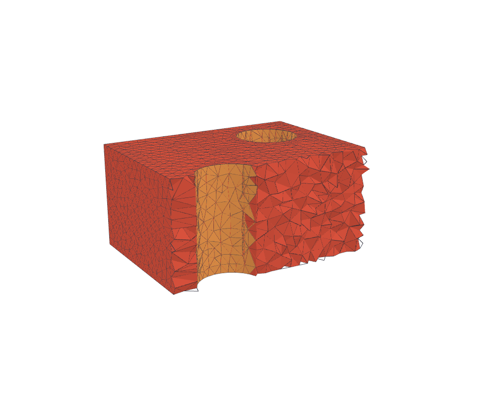
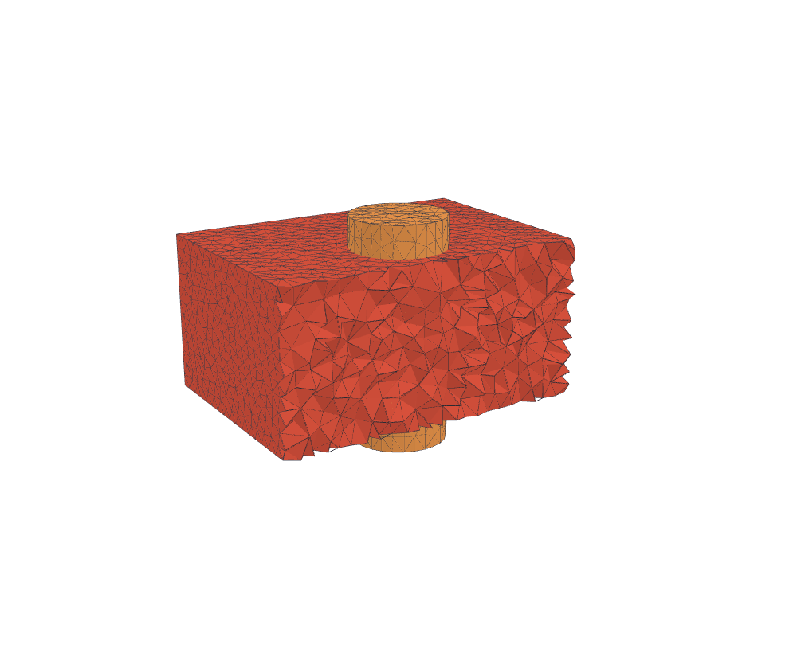
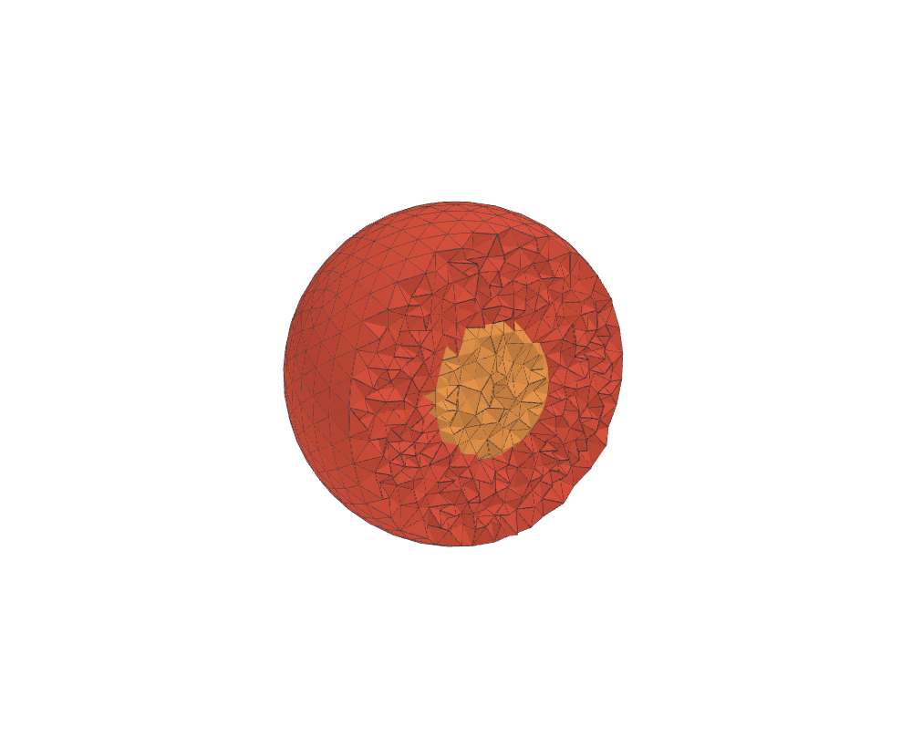
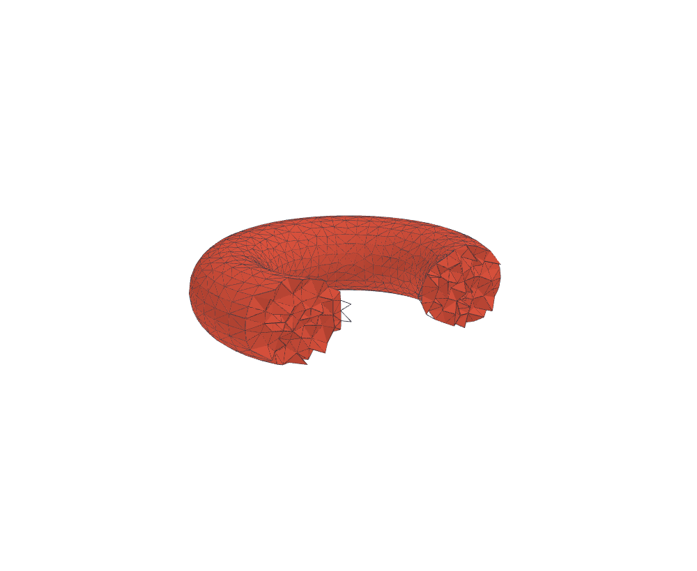
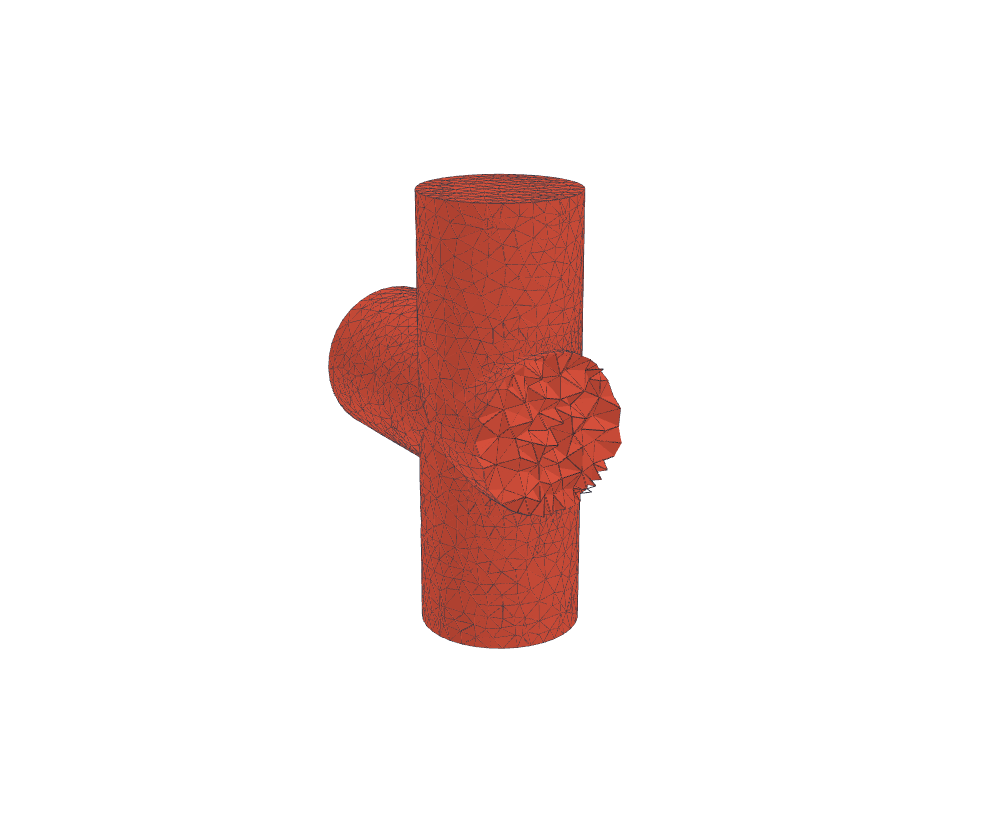
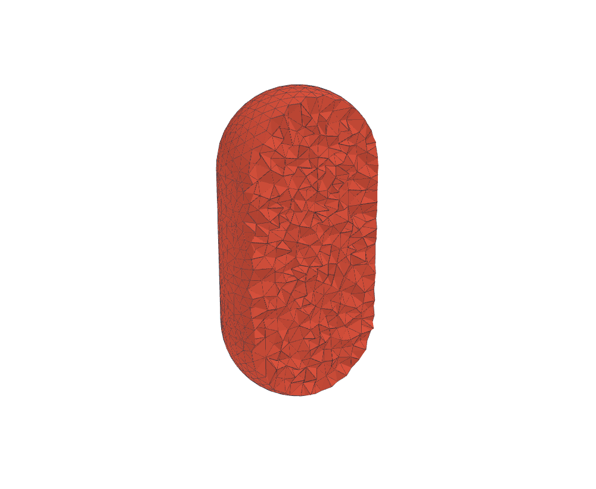

# rapidmesh

Tetrahedral mesh generator for 3D electromagnetic FEM (Maxwell, H(curl)/Nedelec)
in pure Rust, with a first-class 2D path for 2.5D MoM solvers. Solid primitives
and **exact** CSG booleans build a non-manifold B-rep; the volume is meshed by
restricted-Delaunay refinement against the analytic carriers and optimized for
dihedral-angle quality. A Python builder API drives the whole pipeline.

Replaces the gmsh dependency of [rapidfem](https://github.com/milanofthe/rapidfem);
the 2D path drives [rapidmom](https://github.com/milanofthe/rapidmom).

|  |  |
|:--:|:--:|
| boolean difference, cutaway | two-region via |
|  |  |
| nested regions | torus |
|  |  |
| cylinder union | capsule |

Cutaway renders from the validation corpus (101 geometries: primitives,
booleans, multi-region assemblies, RF passives, STL/OBJ imports), regenerated
on every full corpus run.

## Pipeline

1. **Geometry**: primitives (box, cylinder, sphere, cone, torus, prism, sweep,
   loft) assembled into a tagged piecewise-linear complex.
2. **Exact CSG**: a robust arrangement of the input surfaces (exact predicates,
   no float snapping) yields a non-manifold B-rep with exactly conforming
   material interfaces.
3. **Volume mesh**: restricted-Delaunay refinement against the analytic
   carriers. Feature edges are protected Ruppert-style, surface facets and
   interior cells refine under a gradient-limited sizing field, and regions are
   classified by flood fill over the carrier walls. No tet straddles an
   interface.
4. **Optimization**: sliver exudation, edge removal, ODT smoothing and a
   dedicated sliver stage, all targeting the minimal dihedral angle.

## Workspace

| Crate | Purpose |
| --- | --- |
| `rapidmesh-exact` | Exact arithmetic: expansions, interval filter, implicit points, staged predicates |
| `rapidmesh-geom` | Solid primitives, STL/OBJ import, the tagged PLC |
| `rapidmesh-csg` | Exact mesh arrangements, multi-operand boolean expressions |
| `rapidmesh-brep` | Non-manifold B-rep layer between CSG and the mesher |
| `rapidmesh-tet` | The mesher: refinement core, the shared 2D core (`surf2d`), sizing fields, quality optimization |
| `rapidmesh-topo` | Mesh topology + element geometry, and the embedding endpoints (`mesh_2d` / `mesh_layers` / `mesh_3d`) |
| `rapidmesh` | Facade builder API and mesh export |

The Python extension lives in `python/` (PyO3 + maturin).

## Implicit (SDF) solids

Blends, fillets and offset shells — the geometry class exact B-rep CSG cannot
express — enter as implicit solids: a signed-distance expression
(`rapidmesh.sdf` builders: primitives, sharp/smooth booleans, `offset`,
`shell`) is tessellated once into a surface-nets proxy, the exact arrangement
runs on the proxy like on any import, and refinement/optimization project onto
the *analytic* field (gradient-Newton closest point, exact normals, field
curvature for sizing). Booleans across carrier kinds work: an implicit rounded
box against a sharp B-rep box meshes as two conforming regions.

```python
g = rm.Geometry()
rounded = rm.sdf.offset(rm.sdf.box((0, 0, 0), (0.7, 0.7, 0.7)), 0.25)
g.implicit(rounded, (-1.4, -1.4, -1.4), (1.4, 1.4, 1.4))
mesh = g.mesh(maxh=0.3)
```

The corpus category `Implicit` (blend, fillet, cross-kind boolean) gates the
path; the EM use cases are rounded conductor edges, conformal
coating/plating shells (`offset`), and solder/glob-top blends
(`smooth_union`).

## 2D meshing (planar / MoM)

The same `surf2d` core that meshes each 3D surface patch is the standalone 2D
planar mesher: a graded, sliver-free constrained Delaunay triangulation of
tagged polygons-with-holes, plus derived topology (RWG edges, boundary edges)
in one bundle. Within a group, overlapping or abutting regions weld into one
conforming, electrically continuous component; separate groups (metal layers)
never merge. A `target_count` budget scales the sizing field globally so the
mesh lands near the requested triangle count, shared across all layers.

```rust
use rapidmesh_topo::{mesh_2d, mesh_layers, Mesh2DOptions, Region2D};

let sq = Region2D::new(vec![[0.0, 0.0], [1.0, 0.0], [1.0, 1.0], [0.0, 1.0]], 7);
let m = mesh_2d(&[sq], |_p| 0.05, &Mesh2DOptions::default());
// m.points, m.tris, m.tri_tags, m.topo (RWG/boundary edges), m.geom, m.remesh(h)

// Many layers under ONE global triangle budget:
let opts = Mesh2DOptions { target_count: 20_000, ..Default::default() };
let layers = mesh_layers(&[group0, group1], |_p| 0.05, &opts);
```

Options: `min_angle_deg` (Ruppert bound), `target_count` (budget, 0 =
field-driven), `minh`/`maxh` (hard size floor/cap), `grading` (Lipschitz slope
of the sizing field). Enable with the `mesher` feature on `rapidmesh-topo`;
the same API is exposed in Python as `rapidmesh.mesh_2d` / `mesh_layers`.

## Python

```python
import rapidmesh as rm

g = rm.Geometry(maxh=0.4)
g.box(4, 4, 2)
g.cylinder(radius=0.8, height=2, position=(2, 2, 0), void=True)  # a bore

mesh = g.mesh()
mesh.points        # (n_points, 3) float64
mesh.tets          # (n_tets, 4)   uint64
mesh.tet_regions   # region tag per tet
mesh.faces         # surface faces (region interfaces, tagged sheets)
```

See [python/README.md](python/README.md) for the builder API, per-entity
sizing, the returned mesh arrays and the observability surface (timings,
metrics, quality, log).

## Visualization

- `site/`: auto-cycling 3D mesh gallery (SvelteKit + WebGL2), deployed to
  `mesh.rapidpassives.org`.
- `report/render-node/`: headless WebGPU rasterizer rendering the corpus
  gallery to PNG.
- `viewer/`: side-by-side mesh comparison viewer (rapidmesh / gmsh / tetgen).

## License

[MIT](LICENSE).
