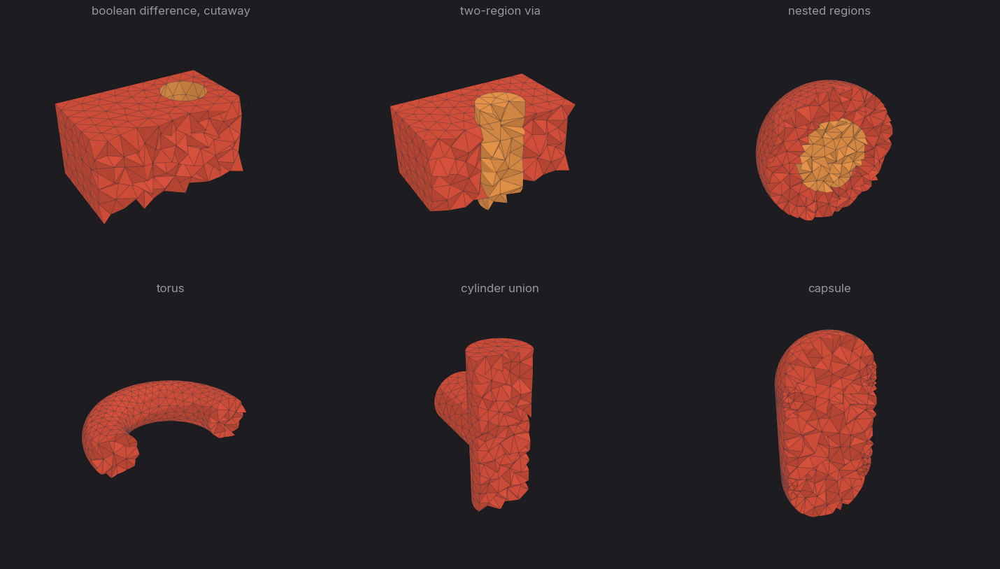
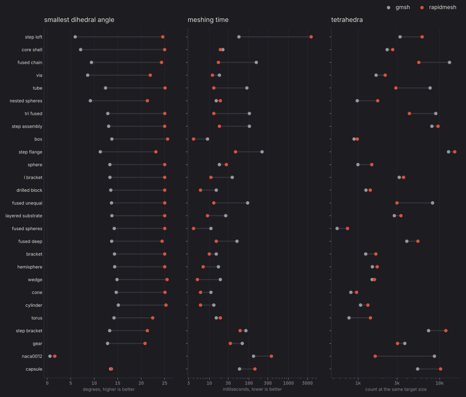
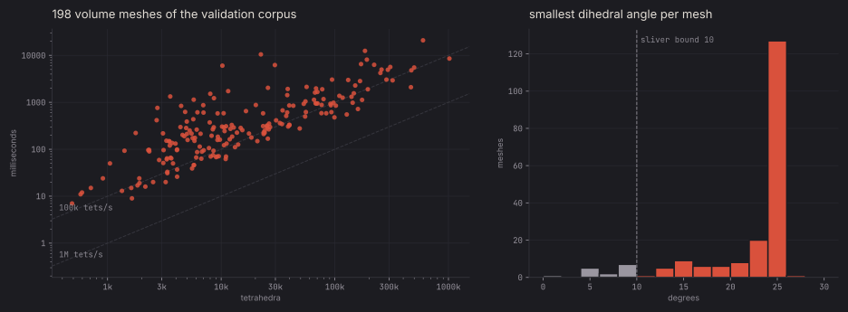

# rapidmesh

Conforming tetrahedral and surface meshes for finite element and finite
volume solvers, written in Rust. Solid primitives, STEP and STL/OBJ imports and
exact CSG booleans build a non-manifold B-rep, which is meshed bottom-up:
edges, then each face on its true surface, then each region on its own.
Every material interface conforms by construction, thin layers cost only
their surfaces, and the improvement aims at the smallest dihedral angle. The
Rust crate is the whole mesher and embeds into any Rust program; the Python
package is a thin layer over the same API.

What a field solver needs comes with the mesh: edge and face topology with
orientation signs, the geometric face or edge every mesh entity lies on,
named sets for ports and boundary conditions, periodic point pairs for unit
cells, gmsh MSH 4.1, VTU, OpenFOAM polyMesh (tets or polyhedral cells)
and CalculiX/Abaqus output,
second-order tets with their mid-edge nodes on the true geometry, and the
finite volume quality (non-orthogonality, skewness) as `checkMesh` measures
it.



More at [mesh.rapidpassives.org](https://mesh.rapidpassives.org).

## Benchmarks

**Against gmsh.** Both mesh the same 27 geometries (primitives, booleans,
multi-region assemblies and four CAD parts read from STEP files) at the same
target size, gmsh with its default 3D algorithm and OpenCASCADE. rapidmesh
has the larger smallest dihedral angle on 26 of the 27 (median 25 against
13.4 degrees) and a tet below 10 degrees on two of them, gmsh on six. It is
faster on 22, with a median meshing time of 0.5 times that of gmsh, and
spends about 1.2 times as many tets.



**Validation corpus.** 223 geometries, 199 of them volume meshes, from single
primitives to RF assemblies, CAD parts from STEP files, scans and chip
layouts. 221 mesh; the other two (a scan and a CAD part with features far
below the size) stop with a `MeshError` that says where. 196 of the volume
meshes are watertight and 168 free of defects (slivers, gaps, faces off the
input). The 18 below 10 degrees are stacks of layers far thinner than the
size, CAD parts with features far below the size, curved edges where two
faces meet at a shallow angle, and sharp wedges.



Large models are cut into blocks meshed in parallel: 2.75 million tets of
tiled passive layouts take about 8 s on an Apple M3.

## Rust

```rust
use rapidmesh::shapes::{Cuboid, Sheet};
use rapidmesh::{FaceFilter, Geometry, MeshOptions, Scope};

let mut g = Geometry::new(Some(1.5));
let air = g.add(Cuboid::new([10.0, 10.0, 13.6]))?;
let sub = g.add_solid(Cuboid::new([10.0, 10.0, 1.6]), Some(0.8), false)?;
g.label_solid(air, "air");
g.label_solid(sub, "substrate");
g.add_sheet(&Sheet::xy(6.0, 6.0, [2.0, 2.0, 1.6]), 1, Some(0.5))?;
g.label_tag(1, "patch");

// a periodic unit cell: the +x side meshed like the -x side, same for y
let side = |n| Scope::surf(Some(FaceFilter::normal(n)));
g.periodic(&side([-1.0, 0.0, 0.0]), &side([1.0, 0.0, 0.0]), None)?;
g.periodic(&side([0.0, -1.0, 0.0]), &side([0.0, 1.0, 0.0]), None)?;
g.name(&Scope::surf(Some(FaceFilter::near([5.0, 5.0, 13.6]))), "port")?;

let mesh = g.mesh(&MeshOptions::default())?;
println!("{}", mesh.report());      // stage timings, worst element, warnings
let sets = mesh.sets();             // cells, faces, edges per name
let view = mesh.view();             // topology, classification, geometry
mesh.write_msh("unit_cell.msh")?;   // physical groups from the names
```

The full example is `crates/rapidmesh/examples/unit_cell.rs`:

```bash
cargo run --release -p rapidmesh --example unit_cell
```

A CAD part comes in with `g.import_step("part.step", None)?`, one solid per
body of the file, each face on its true surface and each solid named as the
file names its part.

Sizing is hierarchical. A scope selects regions, geometric faces or
geometric edges (by id, tag, normal, position or the regions they separate),
and `set_maxh_on` and `set_tol_on` size what it selects. On top come a
global size and grading, sizes per solid and per sheet, point size sources,
an element budget and floors.

## Python

```bash
pip install rapidmesh
```

```python
import rapidmesh as rm

g = rm.Geometry(maxh=0.4)
g.box(4, 4, 2)
g.cylinder(radius=0.8, height=2, position=(2, 2, 0), void=True)  # a bore

mesh = g.mesh()
mesh.points        # (n_points, 3) float64
mesh.tets          # (n_tets, 4)   uint64
mesh.tet_regions   # region tag per tet
mesh.topology      # edges, faces, incidence with signs, classification
mesh.sets()        # named cells, faces and edges
```

See [python/README.md](python/README.md) for the Python API.

## Pipeline

1. **Geometry**: primitives (box, cylinder, sphere, cone, torus, prism,
   sweep, helix, loft), fillets and chamfers, sheets, STEP files (AP203 and
   AP214: planes, quadrics, tori and B-spline surfaces) and STL/OBJ imports
   split at creases.
2. **Exact CSG**: an arrangement of the input surfaces with exact predicates
   and no float snapping yields a non-manifold B-rep with exactly conforming
   material interfaces.
3. **Surface mesh**: each edge is sampled once under a gradient-limited
   sizing field, and each face is meshed alone on its edges' samples, in a
   chart of its surface. Planes are charts of their own. Cylinders, cones,
   extrusions, tubes and slender tori are unrolled. Parts of spheres are
   projected stereographically. Other faces get a height field, and faces no
   chart covers (scans, closed B-spline bands) are remeshed on their facets.
   The faces of a scan smaller than the size join their neighbours. Edges a
   region's Delaunay tetrahedralization lacks are split until it has them.
   Periodic faces are moved copies of their partners.
4. **Volume mesh**: each region is filled by its constrained Delaunay
   tetrahedralization and refined by size. Regions are labelled by
   construction, and a layer far thinner than the size takes flat tets
   through it instead of being refined down to its thickness. A large model
   is cut into blocks, each meshed in parallel, and put back together.
5. **Improvement**: flips, vertex moves along the carriers and peels at the
   boundary aimed at the smallest dihedral angle, then a relaxation of the
   surface.

Where the geometry defeats the mesher (features far below the mesh size,
gaps, degenerate faces), it stops with a `MeshError` that says where and
what to repair, instead of handing out a poor mesh.

## Workspace

| Crate | Purpose |
| --- | --- |
| `rapidmesh` | The API: geometry, sizing, names, periodic pairs, meshes and their output |
| `rapidmesh-exact` | Exact arithmetic: expansions, interval filters, implicit points, staged predicates |
| `rapidmesh-geom` | Solid primitives, NURBS, STL/OBJ import, the tagged PLC |
| `rapidmesh-csg` | Exact mesh arrangements, boolean expressions |
| `rapidmesh-brep` | Non-manifold B-rep between CSG and the mesher |
| `rapidmesh-step` | STEP files onto the model: Part 21 reader, geometry, topology |
| `rapidmesh-tet` | The mesher: surface and volume stages, sizing fields, improvement |
| `rapidmesh-topo` | Mesh topology, element geometry, classification, MSH, VTU and OpenFOAM output |

The Python extension lives in `python/` (PyO3 and maturin).

## License

rapidmesh is dual licensed:

- **Open source** under the [GNU Affero General Public License v3.0](LICENSE).
  Software that embeds rapidmesh, including software offered over a network,
  has to be released under the AGPL as well.
- **Commercial license** for use in proprietary products and services
  without the AGPL obligations. Contact
  [milanrother.com/consulting](https://milanrother.com/consulting/).

Versions up to 0.6.0 were published under the MIT license.

Contributions are accepted under a contributor license agreement, so that
rapidmesh can stay available under both licenses.

Consulting, integration and commercial support:
[milanrother.com/consulting](https://milanrother.com/consulting/)
